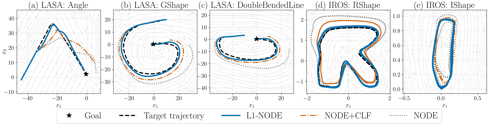

# L1-DS

**Paper reference:** This code implements experiments from the paper: ["A Robust Task-Level Control Architecture for Learned Dynamical Systems"](https://arxiv.org/pdf/2511.09790). For additional context, methodology, and results, please refer to the paper.



This repository holds code and scripts used to train and evaluate task-level dynamical systems models (neural ODEs, SEDS, etc.) on datasets such as LASA and IROS.

## Setup

Create and activate a virtual environment (recommended), and install dependencies:

```bash
python3 -m venv .venv
source .venv/bin/activate
pip install -r requirements.txt
```
## Reproducing Experiments

### 1. Auto-Run Scripts (Recommended)
Shell-script flow: The `auto_run_*` shell scripts (for example `auto_run_node_lasa/auto_run_node_lasa.sh` and `auto_run_node_iros/auto_run_node_iros.sh`) implement the end-to-end workflow for training, evaluation, and plotting. Use these scripts when you want to reproduce full experiments. Common variables you may change inside those scripts:

- `OUT_DIR` / `RESULTS_DIR` — top-level folder for saved outputs and plots
- `MODEL_DIR` — where trained checkpoints are written/read
- `DATA_DIR` — location of datasets (if not downloaded automatically)
- any script-specific flags (look for variable assignments near the top of the script)

Notes:

- Edit the variables at the top of the shell script to change output/model paths before running.
- **Important:** Ensure directory paths (`OUT_DIR`, `MODEL_DIR`, `DATA_DIR`, `RESULTS_DIR`, etc.) are correctly set for your system. Use absolute paths or verify relative paths resolve correctly from the repository root.
- Run scripts from the repository root (`L1-DS`) so that relative paths inside scripts resolve correctly.
- Activate your Python virtual environment first.

Run an auto-run shell script (example):

Make executable (once):

```bash
chmod +x ./auto_run_node_lasa/auto_run_node_lasa.sh
```

Run it:

```bash
./auto_run_node_lasa/auto_run_node_lasa.sh
```

Or without changing permissions:

```bash
bash ./auto_run_node_lasa/auto_run_node_lasa.sh
```

To preview what a script will do without executing heavy steps, open it in an editor or run a syntax check:

```bash
bash -n ./auto_run_node_lasa/auto_run_node_lasa.sh
sed -n '1,200p' ./auto_run_node_lasa/auto_run_node_lasa.sh
```

### 2. Manual Execution

Run training directly (example) with default params (see the python file / shell scripts for the various custom command line interface input argument options):

```bash
python src/train/train_node_lasa.py
```

Run experiments / plotting directly (example) with default settings (see the python file / shell scripts for the various custom command line interface input argument options):

```bash
python src/experiments/run_experiments_lasa.py
python src/experiments/metrics_plots.py
```

## Repository layout

- `requirements.txt` — Python dependencies used by training and experiment scripts.
- `auto_run_node_lasa/`, `auto_run_node_iros/`, `auto_run_seds_lasa/` — high-level shell scripts and example outputs. These orchestrate the experiment flow (prepare data, train models, run rollouts, generate plots).
- `disturbances_visualised/` — pre-rendered disturbance previews.
- `figures/` — generated figures.
- `models/` — model implementations and SEDS helpers.

### `models/`

- `neural_ode.py` — neural ODE model definitions and wrappers used by training scripts.
- `neural_ode2.py` — alternative neural ODE architectures.
- `SEDS/` — SEDS implementation, training utilities and LASA helpers (e.g., `seds_core.py`, `seds_train.py`, `lasa_data.py`).

### `src/` 

This is the main code for experiments, training entrypoints, dataset loaders and utilities.

- `src/__init__.py` - package marker.

- `src/data/`
  - `lasa.py` — loader and preprocessing utilities for the LASA dataset; provides trajectories and helper functions used by training and evaluation.
  - `IROS_dataset/` — utilities for handling the IROS dataset.

- `src/experiments/` — orchestrates evaluation: runs simulators, computes metrics. The main flow is:

  - **Flow:** `run_experiments_*.py` → calls `simulator_*.py` → which calls `disturbances_*.py` → produces rollouts → `metrics_plots.py` computes DTW/errors and plots.

  - `run_experiments_lasa.py`, `run_experiments_iros.py`, `run_experiments_seds.py` — high-level runners that load a trained model, iterate over test scenarios, invoke simulators, and collect results.
  - `simulator_lasa.py`, `simulator_iros.py` — simulators that take a model and initial condition, step through time applying disturbances, and return rollouts. These call `disturbances_*.py` internally to generate the disturbance signals.
  - `disturbances_lasa.py`, `disturbances_iros.py` — define and generate disturbance signals (e.g., step, sinusoidal, noise). Edit these files to add new disturbance types or change magnitude/frequency. Functions typically return time-indexed disturbance arrays.
  - `metrics_plots.py` — computes evaluation metrics (e.g., DTW, RMSE, success rates) and produces comparison plots summarizing experiment results. Run this after `run_experiments_*.py` to visualize outcomes.
  - `rollout_with_training.py` — helper that ties training and rollout steps when needed by auto-run flows.
  - `robust_ctrl.py` — **L1 adaptive control implementation:** contains the piecewise constant law for L1 adaptive control. 
  - `plant_llc.py`, `targets.py` — plant dynamics and target generation utilities used in simulations.

- `src/train/`
  - `train_node_lasa.py` — entrypoint to train models on LASA dataset. Reads config or CLI args and saves checkpoints to `MODEL_DIR`.
  - `train_node_iros.py` — training entrypoint for IROS experiments.
  - `train_node_periodic_epoch_windows.py` — specialized training loop supporting periodic epochs or windowed training.
  - `train_configs/` — example configuration files describing hyperparameters, dataset splits and experiment settings.

- `src/utils/`
  - `plotting.py`, `disturbance_plotting.py`, `disturbance_plotting_latex.py` — plotting utilities for figures and paper-ready images.
  - `compute_*_dtw_summary.py` — scripts to compute DTW (dynamic time warping) summaries for LASA/IROS/SEDS experiments.
  - `seed.py` — RNG seeding helper to produce reproducible runs.
  - `plot_all_disturbances.py`, `plot_five_panel_comparision.py` — higher-level plotting scripts used by the paper/report.

## Customizing disturbances

To change which disturbances are applied during evaluation:

1. Open `src/experiments/disturbances_lasa.py` or `src/experiments/disturbances_iros.py` depending on the dataset.
2. Look for functions like `step_disturbance()`, `sine_disturbance()`, `noise_disturbance()`, etc., or add your own.
3. Modify the amplitude, frequency, or shape of disturbances in those functions.
4. Edit the corresponding `run_experiments_*.py` to call or select different disturbance types when invoking the simulator.
5. Alternatively, modify `simulator_lasa.py` or `simulator_iros.py` to pass different disturbance parameters to the disturbance generation functions.

When you run `run_experiments_lasa.py` (or IROS/SEDS), the simulator will apply whatever disturbances are defined, producing rollouts that are then analyzed by `metrics_plots.py`.

## Data

- LASA dataset helpers are in `src/data/lasa.py` and `models/SEDS/lasa_data.py`.
- Place datasets in the locations expected by the loader functions, or set `DATA_DIR` in shell scripts to point to your local copy.

## Outputs

- Auto-run scripts commonly save trained checkpoints under the `auto_run_*` subfolders (e.g. look for `models/` inside each auto-run directory).

## Development notes

- Use `PYTHONPATH=. python ...` from the repository root when running scripts that import `src` modules.
- To add experiments, add a config to `src/train/train_configs/` and update callers in `src/train/` or the corresponding `auto_run_*` script.
- The experiment flow is: train → `run_experiments_*.py` (simulator + disturbances) → `metrics_plots.py` (metrics + plots). Edit disturbance files to vary evaluation conditions.

## Troubleshooting & tips

- If a shell script fails, inspect its top-level variable assignments and logs printed to the console. To make debugging verbose, add `set -x` at the script top.
- Use `bash -n script.sh` to check shell syntax without running.
- If imports fail, ensure virtual environment is active and `requirements.txt` dependencies are installed.
- Ensure your directories are correctly specified.
- If `run_experiments_*.py` produces unexpected results, check that disturbances are being applied correctly by inspecting the printed logs and the generated plots. 
---


